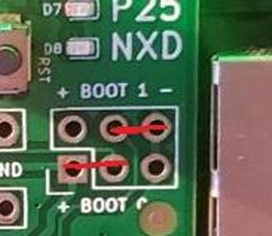

# Flashing a hotspot

## Building the firmware

=== "Hat Hotspot"

    1. Change directories to the firmware folder with
    ``` sh
    cd /opt/centrunk/dvmfirmware-hs
    ```
    2.	Build the firmware binary
    ``` sh
    sudo make -f Makefile.STM32FX mmdvm-hs-hat-dual
    ```
    !!! info
        Depending on the performance of your Raspberry Pi or PC, this step can take a while.

=== "Repeater Board"

    1. Change directories to the firmware folder with
    ``` sh
    cd /opt/centrunk/dvmfirmware-hs
    ```
    2.	Build the firmware binary
        1.	Generic STM32 Board
        ``` sh
        sudo make -f Makefile.STM32F4
        ```
        2.	Repeater Builder Board
        ``` sh
        sudo make -f Makefile.STM32F4_POG
        ```
        3.	WA0EDA V3 cards
        ``` sh
        sudo make -f Makefile.STM32F4_EDA
        ```
        !!! info
            Depending on the performance of your Raspberry Pi or PC, this step can take a while.

## Flashing the board

=== "Hat Hotspot"

    You can flash the hotspot with a USB adapter board (recommended) or directly on the GPIO pins of a Raspberry Pi.

    !!! note ""

        === "USB Adapter Board"
            Flash with the following command while hat is on the USB Adapter Board. Set the adapter switch to position B or ‘ON’, and plug the adapter board into the Pi.  Run the command:
            ``` sh
            sudo stm32flash -v -w dvm-firmware-hs_f1.bin /dev/ttyUSB0
            ```

        === "GPIO Pins"
            1. Using jumper wires, connect the sockets of BOOT 1 and BOOT 2 as shown on the image.
                { align=right }
            !!! danger
                **Make sure the wires are not touching each other!**

            2. With the jumpers connected, press the reset button on the board to put it into programming mode.
            3. Flash the board:
            ``` sh
            sudo stm32flash -v -w dvm-firmware-hs_f1.bin -g 0x0 -R -i 20,-21,21:-20,21 /dev/ttyAMA0
            ```
            4.	Once the board is completely flashed, remove the jumpers added in step 1. This can be confirmed with a 100% progress and a success message in the command line window.
            5.	The board should be ready to go. If unsuccessful, rinse and repeat the steps in this section.

=== "Repeater Board"

    Flash the board with the following commands:

    Repeater Builder Board
      ``` sh
      sudo stm32flash -v -w dvm-firmware_f4-pog.bin -g 0x0 -i 20,-21,21:-20,21 /dev/ttyAMA0
      ```

    !!! info "This is unconfirmed at this time."
        WA0EDA V3 Cards
          ``` sh
          sudo stm32flash -v -w dvm-firmware-eda.bin -g 0x0 -i 20,-21,21:-20,21 /dev/ttyAMA0
          ```

    !!! info "These boards may still have a Boot 0 and Boot 1 pin that need to be jumped like a normal hotspot."
        Generic STM32F4 Board
          ``` sh
          sudo stm32flash -v -w dvm-firmware_f4.bin -g 0x0 -i 20,-21,21:-20,21 /dev/ttyAMA0
          ```
